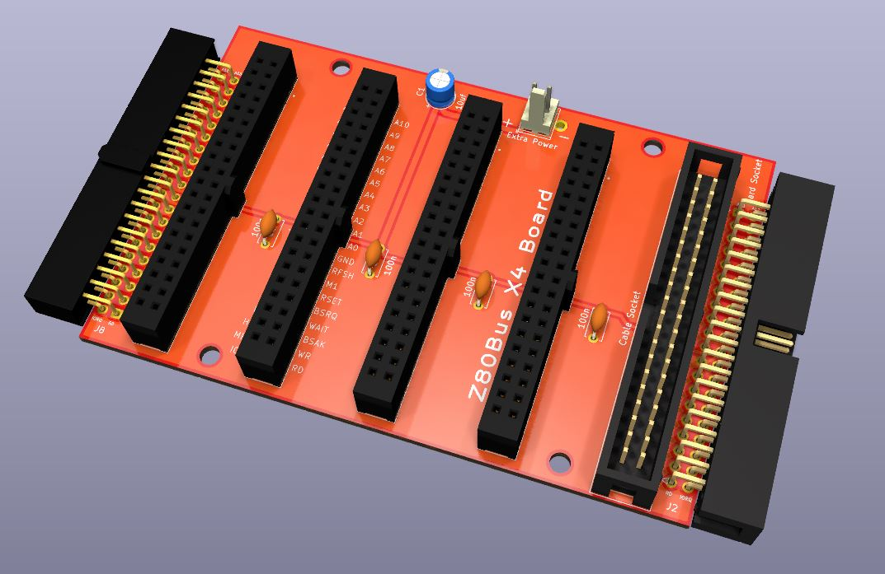

# Z80Bus - Connecting the Past to the Future
## The Past
The current TEC-1F (ashamedly) and all its previous incarnations suffer from a difficult and awkward method of expansion, 
namely stacking things on top of the extra memory socket and then using fly leads to connect extra lines like
any Input/Output port select lines, memory select lines or any extras like the M1 on INT lines which are not 
present in a standard 2K memory socket, let alone any extra address lines like the [Matrix Keyboard](https://github.com/Gonzo-XIII/TEC-1_Hardware/tree/master/Matrix_Keyboard) uses.

Another Z80 machine of the era, essentially copying the TEC-1 in design, was fortunate enough to have a much better expansion system
based on the pinouts of the Z80. It uses a vertical male IDC Boxed Header which unfortunately means you can only use it for often long (and ugly)
IDC cables which have their own issues: You can only have one module plugged in... unless you go hippie and do a daisy chain of an
even longer and uglier cable arangement. Close, but no cigar.

## The Inspiration
I have been involved with and designing boards for the RC2014 system and have to say the ease of creating boards, and the solidity
and neatness of plugging those boards into a base-board, all lined up like little soldiers, was very appealing to me. And then I came across
another similar design that attaches to the Amstrad line of Z80 machines allowing easy expansion, called the X4 system which has become
a defact standard for the CPC line of machines.

This was the insparation for the Z80Bus X4 Board and I had to make it available for the TEC-1. But first, we need an Adapter!

## The Future
With the release of the Z80Bus Standard, including the KiCAD footprints and Gerbers so people can print their own Z80Bus system board,
modules for the TEC-1 can very quickly and easily be developed that allow the USER to choose how they wish to connect the modules to
their machines. Boards designed with the innovative <b>IDC2</b> connector footprint allow the user to choose to go hippie
and continue to use ugly IDC cables with a Vertical IDC Box Header, or with a Right Angled Box Header, they have the ultimate in freedom
to connect using IDC cables, "Quick-Connect" direct to the TEC-1, or using the X4 system and have multiple expansions boards
all working in unison. The Future is NOW!

## How to make your own Z80Bus boards
Download the KiCAD footprint for the <b>IDC2 Connector</b> [here](Z80Bus-Header_V+H_Plug.kicad_mod).

To make really cool and realistic renders of your boards, here are the 3D models of the [IDC connectors](IDC-Headers+Sockets_Vertical+RightAngled.zip). 
Unzip the four files into your KiCad\6.0\share\kicad\3dmodels\Connector_IDC.3dshapes folder.
